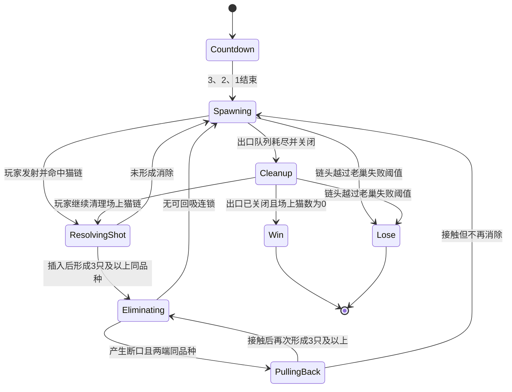

# 《喵喵回窝》核心玩法与轨道逻辑规格

> 2026-09-08 本轮更新：本文件下方旧“当前状态”、逐关等待及 ImageGen → Figma → Cocos 强制流程仅作历史记录，已被 [D008](05_DECISION_LOG.md) 取代；当前仅建立项目记忆，新 UI 流程待确认，禁止自动续跑旧生产任务。未被替代的玩法/质量要求保留；具体状态、几何来源与残留冲突见 [06](06_CURRENT_STATE.md)，新 UI 方向见 [01](01_UI_DIRECTION.md)。

> 状态：2026-09-08 项目所有者认可当前几何方案，允许直接制作全套 ImageGen UI，无需重复逐关送审。  
> 动态插入、回吸、生成计划与可解性仍待验证；本次授权不代表玩法测试通过，不启动 Cocos 重构。  
> 设计目标：保留经典祖玛的空间决策、插入消除、断链回吸与终点压力，并用猫咪主题重新表达。

## 1. 先定义游戏，不先定义画面

《喵喵回窝》是一款单轨、中央发射、三连消除的实时链条解谜游戏。

每关只有四个不可缺少且互相独立的玩法对象：

1. `Source`：唯一的猫猫出口，只负责生成猫猫。
2. `Track`：从出口连接到老巢的唯一连续开放路径。
3. `Launcher`：位于玩法区域正中央、可 360° 旋转的发射猫窝。
4. `Lair`：唯一的罐头老巢；链头进入其失败阈值后立即失败。

任何画面如果不能在 1 秒内看懂“猫从哪里来、沿哪里走、要走到哪里、玩家从哪里发射”，就不是合格关卡。

### 1.1 继承经典祖玛与本作简化

必须保留的经典骨架：唯一生成端、单向链条、明确失败终点、中央瞄准发射、当前/下一发交换、插入组三、断口回吸、接缝连锁、清链胜利。

为抖音小游戏与 OPC 开发规模做的简化：每关使用有限 `spawnPlan`，不做复杂 Boss、分叉轨道、多链并行生成或物理刚体；呼噜暴走只改变节奏和回推距离，不代替瞄准三消。

### 1.2 对本次错误母版的结论

本次被指出的母版不合格，原因不是“需要微调”，而是同时违反四条核心规则：入口方向不唯一、C 形轨道存在无设施端点、下方路线视觉断开、老巢被画成双入口。该母版只能归档为反例，不能在其构图上继续修补。

## 2. 世界观与玩法名词

为避免“回窝”和“碰到老巢失败”产生叙事冲突，统一解释如下：

- 猫猫从庭院外的“迷路入口”排队进入。
- 它们被罐头香味吸引，正在向“罐头老巢”前进。
- 玩家控制中央的“引路猫窝”，把当前猫发射到队伍中。
- 三只或更多同品种猫贴在一起后，会从轨道上飞回各自真正的家，称为“回窝”。
- 若任意一只猫进入罐头老巢，仓库被挤满，本关失败。

固定术语：

| 英文 ID | 中文名 | 唯一职责 |
|---|---|---|
| `Source` | 迷路入口 | 生成队尾猫猫 |
| `Track` | 回窝轨道 | 承载猫链并规定单向顺序 |
| `Launcher` | 引路猫窝 | 360° 瞄准、发射、交换当前/下一只 |
| `Lair` | 罐头老巢 | 定义失败阈值，不生成猫 |
| `Head` | 链头 | 当前最靠近老巢的猫 |
| `Tail` | 队尾 | 当前最靠近迷路入口的猫 |

## 3. 唯一正确的拓扑

```text
迷路入口 Source
       │  P(0)，猫从这里出现
       ▼
  ─────●──────────────────────────────●─────▶ 罐头老巢 Lair
       s=0      唯一、连续、开放轨道       s=L / 失败阈值
                         ╲
                          ╲ 发射弹道
                           ◎ 引路猫窝 Launcher
                              固定在玩法区中央，360°旋转
```

轨道用弧长参数表示为 `P(s)`：

- `s = 0`：迷路入口中心点。
- `s = L`：罐头老巢吞入口中心点。
- 猫猫正常移动方向永远是 `s` 增大的方向。
- 链头拥有当前猫链中最大的 `s`，队尾拥有最小的 `s`。
- `P(s)` 必须是一条开放曲线；`P(0)` 与 `P(L)` 不是同一点。
- 入口只绑定 `P(0)`，老巢只绑定 `P(L)`，中央发射器不绑定轨道端点。

### 3.1 图论验收

把轨道离散为图后必须同时满足：

- 只有两个度数为 1 的端点：`Source` 和 `Lair`。
- 其余轨道节点的度数全部为 2。
- 从 `Source` 出发只能找到一条到达 `Lair` 的路径。
- 不存在环；不能从某节点出发沿前进方向回到自身。
- 不存在分叉、合流、悬空端点或第二个老巢入口。

因此以下设计全部禁止：

- 闭合圆环或看起来像闭合圆环的轨道。
- C 形两端都没有绑定明确设施。
- 一条轨道走到屏幕边缘突然消失。
- 入口出来后既可向左又可向右。
- 老巢有两个洞口或两个轨道同时接入。
- 发射器兼任入口或老巢。

## 4. 出口与老巢

### 4.1 迷路入口 `Source`

- 每关固定一个，位于轨道 `P(0)`。
- 洞口中必须能看见下一只即将出现的猫，强化“由此生成”。
- 洞口朝向必须与 `P'(0)` 相同；猫出现后只能沿一个方向前进。
- 入口前 160px 的轨道必须近似直线或缓弯，让玩家一眼判断方向。
- 入口不能使用危险红色、罐头或仓库造型，避免与老巢混淆。
- 生成结束后入口关闭或熄灭，明确告诉玩家“不会再来新猫”。

### 4.2 罐头老巢 `Lair`

- 每关固定一个，位于轨道 `P(L)`。
- 只允许一个吞入口，轨道中心线必须准确接入该入口中心。
- 造型固定包含暗色洞口、罐头堆和危险边缘光，与迷路入口显著不同。
- `failS = L - catRadius`；链头中心达到或超过 `failS` 立即锁定输入并失败。
- 末段依次显示三个压力区：
  - `s/L ≥ 0.75`：老巢轻晃，末段轨道变暖。
  - `s/L ≥ 0.90`：1.2 秒一次柔和珊瑚脉冲。
  - `s/L ≥ 0.95`：链头猫紧张表情，老巢开口加亮（D024统一末级阈值）。

### 4.3 第一关拓扑基线（仅逻辑，不是 UI 稿）

第一关使用 `P01 顺时针外入内旋`，顺序固定为：

```text
左上 Source（约 154,387）
  → 顶部外圈
  → 右侧外圈
  → 底部外圈
  → 左侧外圈
  → 向内收束但避开中央禁入区
  → 内圈右侧唯一 Lair（约 525,676）
```

- Launcher 固定在 `(375,675)`，位于螺旋中央。
- Source 洞口切线沿顺时针方向，猫出现后不存在“向左还是向右”的选择。
- 轨道从 Source 到 Lair 一笔连续，中途没有消失、第二端点或第二入口。
- Lair 之后没有轨道；视觉上由单个暗洞吞入口明确结束。
- 该拓扑先以黑白样条验证，通过后才能交给 ImageGen 表现庭院、美术轨道和设施。

## 5. 中央发射器

- 设计基准为 750×1334；扣除顶部 HUD 和底部道具后，玩法区域为 `y=190..1160`。
- 发射器中心固定为 `(375, 675)`，100 关保持一致，建立肌肉记忆。
- 发射器不得位于屏幕底边，也不得吸附到任一轨道端点。
- 发射器可连续旋转 `0..360°`，没有机械死角。
- 当前猫显示在发射器中心；下一只显示在其右下侧独立气泡内。
- 点击发射器中心交换当前猫与下一只；拖动超过 16px 后不判为交换。
- 发射器外缘到轨道中心线的最小距离为 `catRadius + launcherRadius + 24px`，不能与轨道重叠。

### 5.1 可射性硬门槛

对发射器每 2° 发出一条射线，计算与轨道猫碰撞管道的首次交点：

- 上、右、下、左四个象限都必须至少有一个有效可射区。
- 第 1～20 关总有效角覆盖不低于 220°。
- 第 21～60 关不低于 200°。
- 第 61～100 关不低于 180°。
- 任一单独可射窗口不得窄于 12°。
- 入口、老巢和装饰不得遮挡超过连续 40° 的瞄准范围。

这保证“中央发射”真正产生多方向选择，而不是视觉上在中央、实际上只能打一排。

## 6. 一局游戏的完整流程



### 6.1 固定帧顺序

每个逻辑帧严格按以下顺序处理，不能互换：

1. 读取输入并更新瞄准。
2. 更新飞行中的发射猫。
3. 检测发射猫与猫链的首次碰撞。
4. 执行插入并重排局部间距。
5. 检查同品种连续段并消除。
6. 处理断口回吸与二次连锁。
7. 按状态推进独立链段的 `s`；解析期间暂停整链移动。
8. 仅在 `Flowing` 从唯一出口按计划生成新猫；解析期间不生成。
9. 检查老巢失败阈值。
10. 检查出口关闭且场上清空的胜利条件。

失败检查必须在胜利检查之前，避免最后一帧链头已入老巢却被错误判胜。

## 7. 生成与队列

- 每关有有限的 `spawnPlan`，由若干 2～5 只的同品种块组成。
- `Source` 是唯一生成位置；不得在轨道中间凭空创建普通猫。
- D024：生成只在 `Flowing` 进行；`Resolving` 中暂停生成和整链移动，解析自身的局部插入/回吸仍按解析器执行。
- 第一只猫从 `s=0` 出现，后续猫保持 `catSpacing`。
- 当入口到队尾的空位不足一只猫直径时暂停生成，空位恢复后继续。
- `spawnPlan` 耗尽后，入口播放关闭反馈，本关进入 `Cleanup`。
- 当前发射猫和下一只猫只能从“场上仍存在或生成计划仍会出现”的品种中选择。
- 某品种已经从场上和剩余计划同时消失后，最多再保留 1 发缓冲，随后必须从发射池移除。
- 连续 8 发不能都无法与当前猫链形成潜在二连或三连。

## 8. 瞄准、命中与插入

### 8.1 输入

- 在非 UI 区域按下或滑动，瞄准方向为 `touch - launcherCenter`。
- 发射预览线必须显示首个可能命中的猫，不穿透前景猫。
- 松手发射；手指回到发射器 48px 内松开视为取消。
- 同一时刻最多有一只玩家发射猫在飞行，避免移动端判定混乱。

### 8.2 碰撞

- 发射猫与轨道猫都使用圆形逻辑碰撞体。
- `catRadius = 32..36px`；判定半径不得随表情动画缩放。
- 使用连续碰撞检测，避免高速发射穿透。
- 一条射线上有多个候选猫时，只命中距离发射器最近的一个。

### 8.3 插入侧

命中轨道猫 `C` 后，先得到其弧长位置 `sC` 与单位切线 `T=P'(sC)`：

```text
side = dot(projectileCenter - C.center, T)
side < 0  -> 插在 C 的入口侧（更小的 s）
side >= 0 -> 插在 C 的老巢侧（更大的 s）
```

- 插入位置由轨道顺序决定，不能由屏幕 x/y 大小决定。
- 局部猫链用 120ms 弹性位移腾出一只猫的空间。
- 新猫稳定到轨道中心线后才执行三连检查。
- 命中入口、老巢、装饰或空轨道不产生插入；发射猫回收并补下一发。

## 9. 三连、断链、回吸与连锁

### 9.1 三连

- 插入完成后，以新猫为中心向入口侧和老巢侧扫描连续同品种猫。
- 连续数量 `>=3` 时整段消除；没有上限。
- 被消除猫播放“贴贴蓄力 120ms → 飞回窝 420ms”。
- 一次发射只允许从命中点开始首轮匹配，不能消除远处无关旧三连。

### 9.2 断链

- 消除后，原链可能分为入口侧链段 `BackSegment` 和老巢侧链段 `FrontSegment`。
- 两段保持各自顺序；断口必须真实存在，可允许发射猫穿过形成穿缝奖励。
- 普通移动时所有链段沿同一 `P(s)` 向老巢方向移动；断口是短暂战术窗口，不允许永久存在。

### 9.3 回吸

- 若断口两侧边界猫同品种，`FrontSegment` 立即以基础速度的 2.2 倍向入口方向回滚。
- 回滚方向是 `s` 减小，而不是按屏幕上的左、右、上、下判断。
- 接触 `BackSegment` 后合并，并从接触边界再次检查三连。
- 若再次消除，连锁层数 `comboDepth += 1`，重复断链与回吸。
- 两侧品种不同则不触发反向回吸；`BackSegment` 在基础前进速度上增加 160px/s 的追赶速度，直到追上 `FrontSegment`。
- 非同色断口最多保留 2.4 秒；这段时间维持 Flowing，允许玩家穿缝射击。
- 断口存在期间若玩家插入改变边界并使两侧同品种，立即切换为反向回吸逻辑。

## 10. 呼噜暴走

呼噜槽是《喵喵回窝》的主题强化，不替代祖玛基础规则。

- D024统一基础呼噜值：`removedCount × 8 + max(0, removedCount - 3) × 4 + max(0, chainDepth - 1) × 10`。教学倍率、0～100钳制及安全触发条件遵循PRODUCT 5.4；道具直接移除不增加呼噜值。
- 呼噜槽满后自动进入 4 秒暴走：猫链速度降至 55%，每次有效消除额外将链头向入口方向推回 1.5 只猫距离。
- 暴走不直接无条件清屏，避免破坏瞄准与插入的核心乐趣。
- 第 1 关在玩家 30 秒仍未形成连锁时提供一次暴走保底。

## 11. 胜负条件

### 胜利

必须同时满足：

1. `spawnPlan` 已耗尽。
2. `Source` 已关闭。
3. 轨道上所有链段猫数为 0。
4. 没有飞行中或等待插入的玩家发射猫。
5. 当前帧没有触发老巢失败。

### 失败

任意链段的链头中心满足 `s >= failS` 时立即失败：

- 锁定发射输入。
- 停止生成与移动。
- 老巢播放吸入反馈。
- 进入“罐头仓库挤满啦”界面。

## 12. 轨道几何硬约束

设计基准 750×1334：

| 项目 | 约束 |
|---|---|
| 轨道类型 | 单一、开放、无分叉的 C1 连续曲线 |
| 轨道宽度 | 1～20 关 88px；21～100 关 72px（2026-09-07 已确认） |
| 猫中心 | 始终投影在 `P(s)` 上，误差 ≤4px |
| 最小曲率半径 | 1～20 关 ≥96px；21～100 关候选 ≥84px，必须重新验证 56px 猫径/58px 间距不重叠 |
| 相邻非连续轨道间距 | 1～20 关中心线 ≥112px；21～100 关 ≥88px |
| Source 到首个急弯 | ≥160px |
| Lair 前直线/缓弯长度 | ≥140px |
| 端点数量 | 恰好 2 个 |
| 自交 | 第 1～80 关禁止；第 81～100 关也默认禁止 |
| 屏幕边界 | 轨道碰撞管道不得越出玩法安全区 |
| 发射器禁入区 | 以 `(375,675)` 为圆心、半径 108px 内无轨道 |

“看起来像能走”和“逻辑上真的连续”必须同时成立。美术轨道中心线与碰撞样条必须来自同一份路径数据，禁止分别手画。

## 13. 关卡路径模板原则

100 关必须独立完成路径与决策设计，统一使用数据驱动的曲线和队列实现。废止“20 模板 × 连续 5 变体”的映射，不通过镜像、旋转、缩放、换背景或只调数值充当新路线。路径合法性、形态去重、实际猫链首撞、开缝收益与动态通关分别验收，细则见 [V2 轨道整改](TRACK_REDESIGN_REVIEW.md)。

所有模板都必须：

- 明确绑定一个 Source 和一个 Lair。
- 在轨道纹理上每 180～240px 放置一个朝向老巢的脚印箭头。
- 至少经过中央发射器的四个象限。
- 为远端补位、近端解危和穿缝射击提供不同角度。
- 不通过分叉、多出口、多老巢制造伪复杂度。

建议模板族：开放 C、开放 S、单圈内旋、反向内旋、双弯马蹄、长钩、三段波浪、泪滴开口、圆角方旋、开放 G、双 C、蛇形阶梯、椭圆内旋、问号弯、心形开口、爪印波形、阴阳 S、钥匙孔开口、长尾螺旋、终章大螺旋。

## 14. 100 关递进框架

| 章节 | 关卡 | 教学与压力 | 新增内容 |
|---|---:|---|---|
| 1 晴日庭院 | 1～10 | 出口、方向、中央瞄准、插入、三连、交换 | 无障碍；五猫从第1关登场 |
| 2 纸箱小巷 | 11～20 | 目标优先级、近端解危 | 纸箱猫 |
| 3 灰尘花房 | 21～30 | 识别延迟、保持选择空间 | 灰扑扑猫 |
| 4 弯桥午后 | 31～40 | 远近轨道切换、穿缝 | 更强遮挡但不自交 |
| 5 海风猫站 | 41～50 | 分段速度、暴走时机 | 速度波 |
| 6 果园仓库 | 51～60 | 两类障碍组合 | 组合编排 |
| 7 雪夜长廊 | 61～70 | 长链、多断口管理 | 多链段但仍从同一出口生成 |
| 8 星光屋顶 | 71～80 | 老巢压力、远端救场 | 更短老巢缓冲段 |
| 9 灯会巡游 | 81～90 | 全机制组合、连锁目标 | 高阶参数组合 |
| 10 百猫回窝 | 91～100 | 稳定发挥与终章高潮 | 不新增规则，只做掌握度验证 |

每 10 关第 10 关是章节综合关，但不新增一次性 Boss 规则，控制 OPC 开发复杂度。

## 15. 自动验证门槛

每条轨道进入 ImageGen 或 Figma 前必须通过：

1. `endpointCount == 2`。
2. `sourceBindings == 1` 且 `lairBindings == 1`。
3. `hasCycle == false`。
4. `hasBranch == false`。
5. `hasDisconnectedStub == false`。
6. `P(0)` 与 Source 洞口中心误差 ≤4px。
7. `P(L)` 与 Lair 洞口中心误差 ≤4px。
8. `minCurvatureRadius >= level.geometryProfile.minRadius`（前 20 关 96px，后 80 关候选 84px，须通过猫不重叠验证）。
9. `launcherTrackClearance >= 108px`。
10. 四象限都有有效射击窗口。
11. 脚印箭头全部沿 `+s` 指向 Lair。
12. 入口和老巢的轮廓、颜色、图标不能相似。

每关至少运行 500 个确定性种子模拟：

- 第 1～10 关帮助型 AI 通关率 ≥95%。
- 第 11～30 关 ≥88%。
- 第 31～60 关 ≥78%。
- 第 61～80 关 ≥68%。
- 第 81～100 关 ≥58%。
- 不允许连续 8 发都没有潜在消除。
- 不允许发射池出现“场上和未来都不存在”的猫。
- 不允许在玩家无可见射击窗口时继续推进猫链。

## 16. 设计与开发顺序

1. 项目所有者验收本文的玩法逻辑。
2. 用路径数据画黑白拓扑图，只检查入口、方向、连续性、中央可射性和老巢。
3. 100 关逐关通过几何、形态差异、实际猫链首撞、动态接缝、500 种子模拟和人工灰盒验收；静态角覆盖不能替代。
4. 再生成 ImageGen 关卡视觉母版。
5. 再用 Figma 独立图层复现并逐关对照。
6. 项目所有者验收 Figma。
7. 最后才允许 Cocos 实现。

禁止再次从“先画一张漂亮的花园图”开始倒推玩法。

## 17. 参考基线

- PopCap 官方 Xbox 合集说明：中央角色瞄准并发射、三只同色清除、阻止链条到达终点。  
  <https://static-www.ec.popcap.com/support.popcap.com/sites/support.popcap.com/files/XBox_Vol1_manual.pdf>
- Zuma Deluxe 随游戏手册存档：当前/下一发交换、终点失败、停止生成、连锁、穿缝奖励与计分说明。  
  <https://www.scribd.com/document/26206789/Zuma-Deluxe-Copyright-2003-2004-PopCap>
